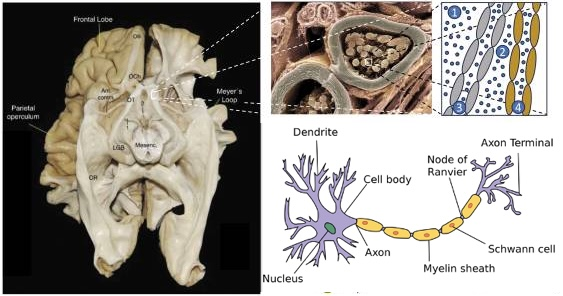
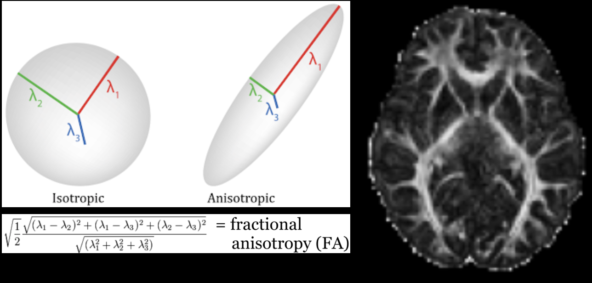
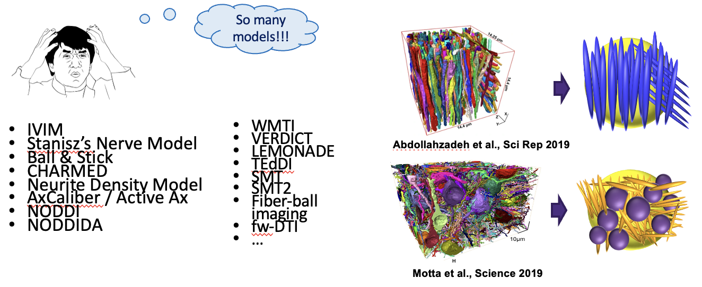
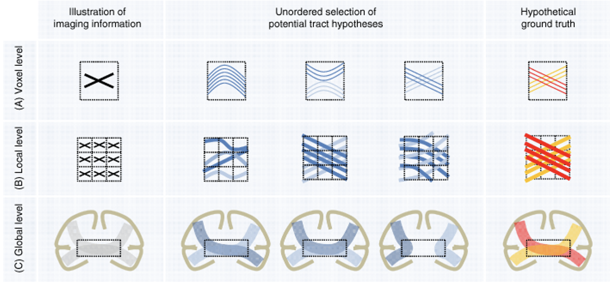
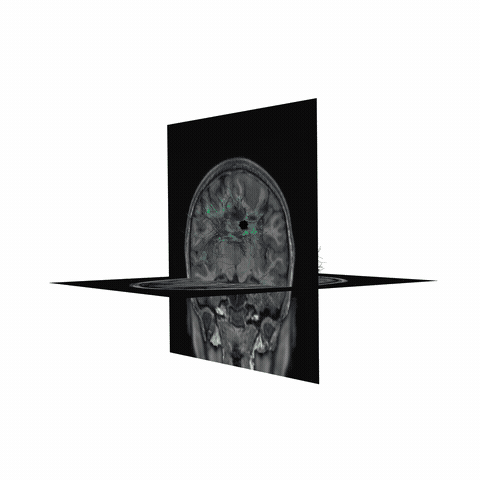
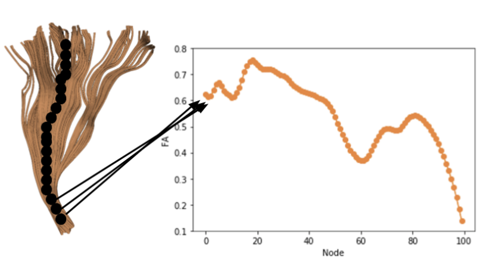
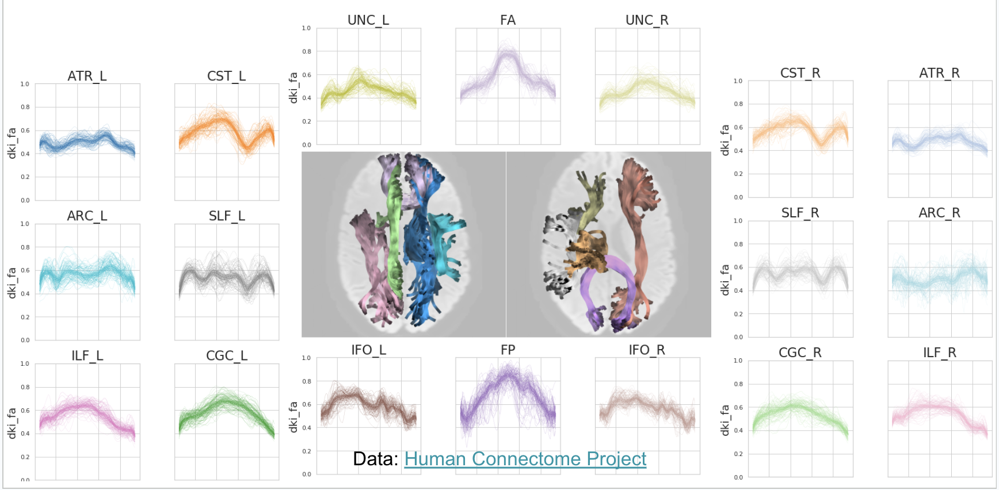
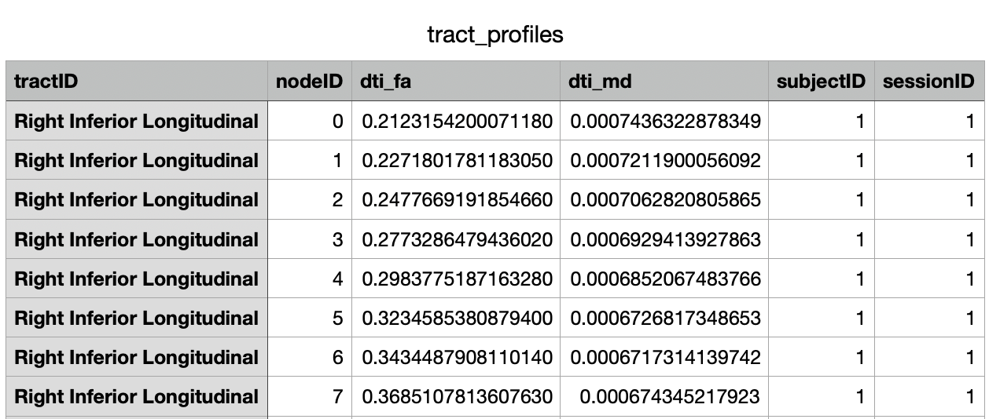
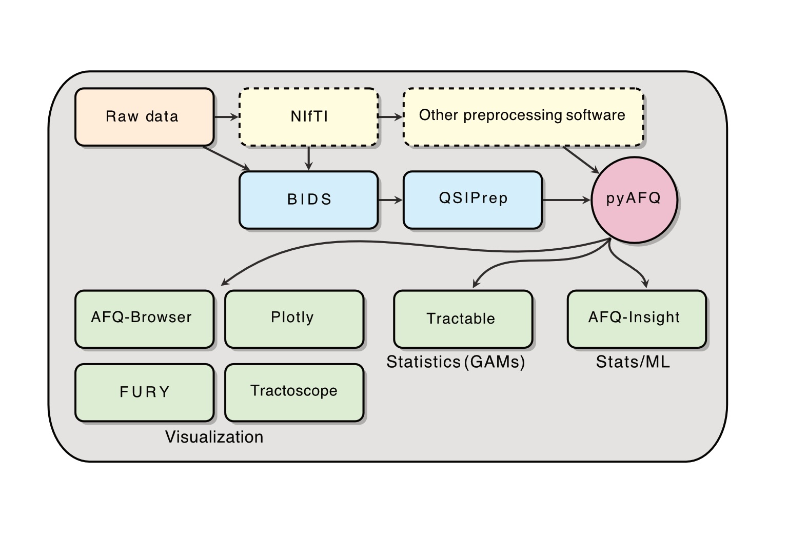

############
 Tractometry
############

Tractography based on diffusion weighted MRI (dMRI) is used to find the major
white matter fascicles (tracts) in the living human brain. The health of these
tracts is an important factor underlying many cognitive and neurological
disorders.

Tissue properties may vary systematically along each tract: different
populations of axons enter and exit the tract, and disease can strike at local
positions within the tract. Because of this, quantifying and understanding
diffusion measures along each fiber tract (the tract profile) may reveal new
insights into white matter development, function, and disease that are not
obvious from mean measures of that tract :cite:p:`Yeatman2012`.

pyAFQ is an open-source software tool for the analysis of brain white
matter in diffusion MRI measurements. It implements a complete and
automated data processing pipeline for tractometry, from preprocessed
DWI data to white matter tract identification,
as well as quantification of tissue
properties along the length of the major long-range brain white matter
connections. The pipeline can be broken down into 4 steps we will go
over:

1. Model fitting to the DWI data
2. Tractography
3. Bundle Recognition
4. Tract profiling

Model Fitting
=============

Diffusion data is typically on the order of 1.5-2mm cubic voxels. The
underlying axons are micrometers in size. So what are we actually
measuring? The patterns of large groups of axons!

   
Takemura et al. (2024)

When you collect diffusion data, you are perturburing water molecules
and observing how they respond. Within the gray matter and corticospinal
fluid (CSF), they typically respond roughly isotroptically. But in large
groups of axons, the myelin sheath constrains water diffusion and
produces an anisotropic signal! Here we visualize this as a tensor,
which is how diffusion tensor imaging (DTI) models the data.

.. container:: custom-container

   .. container:: row

      .. container:: col

         .. image:: ../_static/diffusion-isotropic.gif
            :width: 100%
            :align: left

      .. container:: col

         .. image:: ../_static/diffusion-anisotropic.gif
            :width: 100%
            :align: right

   .. container:: row

      .. container:: col

         .. image:: ../_static/tropic.png
            :width: 100%
            :align: center

.. container::

   .. image:: ../_static/dti_in_brain.png
      :width: 100%
      :align: left

One common metric of DTI is fractional anisotropy (FA), a measure of
anisotropy. FA corresponds to multiple underlying biological phenomenon,
such as myelination, axon coherence, density of axons.

Notice: There are many models for modelling diffusion data, and many
acronyms! Here we introduced diffusion tensor imaging (DTI), and one
metric from DTI: fractional anisotropy (FA). But pyAFQ uses many more
models and metrics than just this!

Thanks: Rafael Neto-Henriques

Tractography
------------

Visualize streamlines generated from diffusion MRI data, generated
through probabilistic tracking algorithms. This initial tractography
output is generated with a monte carlo approach, and is attempting to
represent the set of potential white matter pathways. This means many of
these streamlines are not biologically plausible.

.. container:: custom-container

   .. container:: row

      .. container:: col

         .. image:: ../_static/modelling.png
            :width: 100%
            :align: left

      .. container:: col

         .. image:: ../_static/modeltotrack.png
            :width: 100%
            :align: right

   .. container:: row

      .. container:: col

         .. image:: ../_static/sphx_glr_plot_stages_of_tractometry_004.gif
            :width: 100%
            :align: center

Jeurissen et al., 2017, also: Behrens, 2013,
Descoteaux, 2014, Dell'Acqua, 2014, Tournier, 2014

Notice: probabilistic tracking is used due to the inherent ambiguity of
the data 

Maier-Hein et al., 2014

ROIs and Recognized Bundles
---------------------------

There are many ways of filtering away streamlines that are not
biologically possible. We use anatomical waypoint regions (ROIs) to
select specific fiber bundles from the full tractography. The ROIs are
shown for the arcuate in blue (left), and then the recognized arcuate
after filtering in cleaning is shown (right).

.. container:: custom-container

   .. container:: row

      .. container:: col

         .. image:: ../_static/arcuaterois.png
            :width: 100%
            :align: center

   .. container:: row

      .. container:: col

         .. image:: ../_static/sphx_glr_plot_stages_of_tractometry_005.gif
            :width: 100%
            :align: left

      .. container:: col

         .. image:: ../_static/sphx_glr_plot_stages_of_tractometry_006.gif
            :width: 100%
            :align: right

Tract Profiling
---------------

We can also visualize the values of tissue properties along the bundle.
Here we will visualize the fractional anisotropy (FA) along the arcuate
bundle (left) and corticospinal tract (right).

Here, the x-axis is nodes and represents the position along the
bundle, and the y-axis is the value of the tissue property (FA) at that
position. The nodes are evenly spaced along the length of the bundle.

Finally, we can visualize the core of the bundle and the tract profile.
The core of the bundle is the median of the streamlines, and the tract
profile is the values of the tissue property along the core of the
bundle.

.. container:: custom-container

   .. container:: row

      .. container:: col

         .. image:: ../_static/sphx_glr_plot_stages_of_tractometry_011.gif
            :width: 100%
            :align: left

      .. container:: col

         .. image:: ../_static/sphx_glr_plot_stages_of_tractometry_012.gif
            :width: 100%
            :align: right

Output of pyAFQ
---------------

We can visualize the tract profiles as a table and store them in a CSV.
You can plot the tract profiles for each bundle as a line plot, with the
x-axis representing the position along the bundle, and the y-axis
representing the value of the tissue property (top). You can also export
in a CSV to import to any statistics/machine learning model of your
choice (bottom).

Running pyAFQ in practice
=========================

`Getting started with pyAFQ - ParticipantAFQ <tutorials/tutorial_examples/plot_002_participant_afq_api.html>`_

AFQ Insight Example
===================

`AFQ-Insight, analysis after
pyAFQ <https://tractometry.org/AFQ-Insight/auto_examples/plot_als_classification.html>`__

Resources Overview
==================

Kruper et al., 2025

Ecosystem Examples
==================
`Neurolibre Preprint <https://preprint.neurolibre.org/10.55458/neurolibre.00037/>`__

Tracometry Ecosystem
====================
+----------------+------------------------------------------------------------+--------------------------------------+
| Name           | Description                                                | URL                                  |
+================+============================================================+======================================+
| **QSIPrep**    | Configures pipelines for pre-processing dMRI data, such    | `qsiprep.readthedocs.io/             |
|                | as: distortion correction, motion correction, denoising,   | <qsiprep.readthedocs.io/>`__         |
|                | etc.                                                       |                                      |
+----------------+------------------------------------------------------------+--------------------------------------+
| **pyAFQ**      | Automated Fiber Quantification (AFQ) in Python: performs   | `tractometry.org/pyAFQ/              |
|                | tractometry on the preprocessed data, and generates        | <tractometry.org/pyAFQ/>`__          |
|                | tractograms for known tracts and their tissue properties   |                                      |
|                | in a CSV for visualization and statistics. By default, it  |                                      |
|                | also uses the interactive graphing library Plotly to       |                                      |
|                | generate HTMLs. Plotly is pip-installable and works in a   |                                      |
|                | headless environment, which makes it convenient on         |                                      |
|                | servers.                                                   |                                      |
+----------------+------------------------------------------------------------+--------------------------------------+
| **AFQ-Browser**| A web-based visualization tool for exploring tractometry   | `tractometry.org/AFQ-Browser/        |
|                | results from pyAFQ. pyAFQ will generate all necessary      | <tractometry.org/AFQ-Browser/>`__    |
|                | inputs to AFQ-Browser in the right format using the        |                                      |
|                | ``assemble_AFQ_browser`` method.                           |                                      |
+----------------+------------------------------------------------------------+--------------------------------------+
| **FURY**       | A Python library for advanced 3D visualization, with       | `fury.gl/                            |
|                | specific methods for neuroimaging and tractography. This   | <fury.gl/>`__                        |
|                | can be useful for visualizing the tractography files       |                                      |
|                | generated by pyAFQ.                                        |                                      |
+----------------+------------------------------------------------------------+--------------------------------------+
| **Tractoscope**| A tool for interactive visualization and analysis of       | `nrdg.github.io/tractoscope/         |
|                | tractography data designed to work specifically with       | <nrdg.github.io/tractoscope/>`__     |
|                | qsiprep/pyAFQ-produced datasets. It uses the niivue        |                                      |
|                | library.                                                   |                                      |
+----------------+------------------------------------------------------------+--------------------------------------+
| **tractable**  | An R library for fitting Generalized Additive Models       | `tractometry.org/tractable/          |
|                | (GAMs) on the tractometry data output by pyAFQ in CSVs.    | <tractometry.org/tractable/>`__      |
+----------------+------------------------------------------------------------+--------------------------------------+
| **AFQ-Insight**| A library for statistical analysis of tractometry data in  | `tractometry.org/AFQ-Insight         |
|                | python, including both machine learning and statistical    | <tractometry.org/AFQ-Insight>`__     |
|                | workflows. It uses the CSVs of tissue properties outputted |                                      |
|                | by pyAFQ.                                                  |                                      |
+----------------+------------------------------------------------------------+--------------------------------------+

Table of Contents for Explanations
----------------------------------
.. toctree::
    :maxdepth: 2

    bundle_orientation
    modeling
    profiling
    recognition
    tractography
